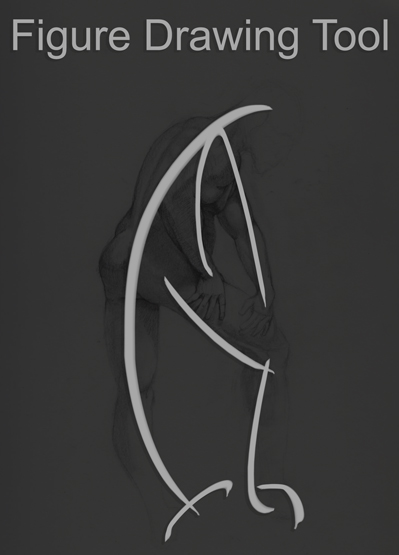

# Figure Drawing Tool


## Using the Spec Files
I use [pyinstaller](https://pyinstaller.org/en/stable/) to compile the apps. Unfortunately, in order to compile per OS you actually need to be on that os (a Virtual Box works just fine).

### With the spec files all you need to do is run:

```codeowners
pyinstaller figure_drawing_tool_win.spec
```
OR

```codeowners
pyinstaller figure_drawing_tool_osx.spec
```

This'll build a build environment and compile the tool into an executable or an app. The resulted file is in the dist directory.
